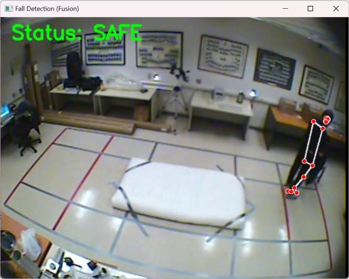
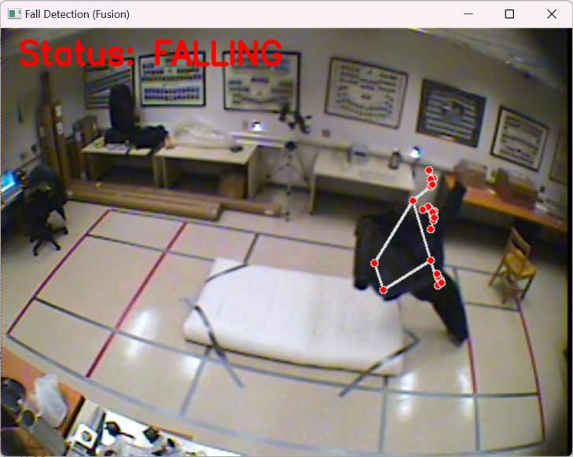
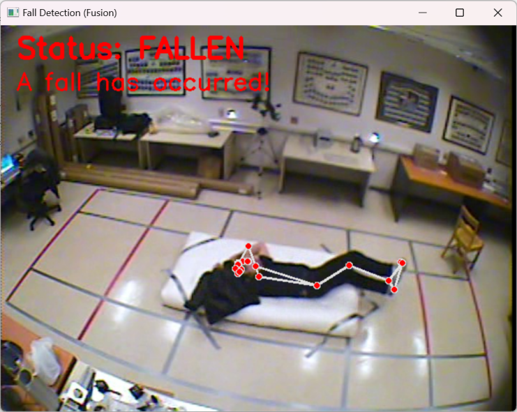

# ERP
# Smart Home Fall Detection System

##  Introduction
This project focuses on the development of an elderly fall detection system using computer vision and machine learning techniques. 
It explores multiple approaches including:
- **3D Convolutional Neural Networks (3DCNN)** for spatio-temporal feature extraction from video frames.
- **Skeleton-based features** (keypoints and joint angles) combined with unsupervised clustering.
- **Support Vector Machine (SVM)** for supervised classification of pose-based features.

---
##  Project Structure

```bash
Preparation
│── Extract_Frame.py
Train 3DCNN model
│── 1.3DCNN_model.py 
│── 2.Only_Mediapipe.py 
│── 3.Model_mediepipe.py 
│── 3DCNN_performance.py
Cluster analysis of key points of posture
│── 4.1 Extract_keypoint.py
│── 4.2 PCA_visualization.py
│── 4.3 Clustering_evaluation.py
Cluster analysis of Angle + Time of posture
│── 5.1 Angles_per_frame.py
│── 5.2 Time_window_features.py
│── 5.3 Time_Clustering.py
SVM classification
│── SVM_classification,py
│── README.md # Project description
```
##  Requirements
- numpy==1.26.4
- pandas==2.2.3
- matplotlib==3.9.4
- scipy==1.13.1
- scikit-learn==1.3.0
- torch==2.5.1
- torchvision==0.20.1
- Pillow==11.2.1
- opencv-python==4.11.0.86
- mediapipe==0.10.21
- tqdm==4.65.2
  
You can install dependencies with:
```bash
pip install -r requirements.txt
```

## Screenshots

- Safe State  
  

- Falling State  
  

- Fallen State  
  


## Usage

1. **Prepare video frames**
   - Split your video into frames, using script:
   ```bash
   python Extract_Frame.py --video_root * --output_root * --fps_interval *
   ```
   - This script extracts frames from multiple `.avi` videos and saves them as `.jpg` images.
   - Make sure frame filenames contain numbers, e.g. `0001.jpg, 0002.jpg, ...`

2. **Run the program**
   ```bash
   python 3.Model_mediapipe.py
   ```
   
##  Results
- 3DCNN achieved ~97% validation accuracy on the Multiple Cameras Fall Dataset.
- Unsupervised clustering on keypoint/angle features showed limited separation (Purity ~0.52).
- SVM achieved 76.15% accuracy and ROC-AUC of 0.836, outperforming clustering approaches.
- Figures such as accuracy/loss curves, PCA visualizations, clustering results, and ROC curves are available in the results/ folder.

##  Contributions
- Provided a systematic comparison between deep learning, supervised learning, and unsupervised learning for fall detection.
- Explored the use of skeleton-based features for lightweight and interpretable models.
- Established performance baselines for future research in elderly fall detection.

## Future Work
- Improve generalization using larger, more diverse datasets.
- Incorporate temporal modeling (RNN, LSTM, or GNNs) for sequential skeleton analysis.
- Develop lightweight models for real-time deployment on edge devices.

## Dataset
- The dataset is not included in this repo due to size limits.  
- Please download it from: [Google Drive link](https://www.iro.umontreal.ca/~labimage/Dataset/)
- Please download data annotation from: [Google Drive link](https://www.kaggle.com/datasets/soumicksarker/multiple-cameras-fall-dataset?resource=download)
- After downloading, place it under:
```bash
- D:/ERP/videos/
  ├── chute01/
  │     ├── cam1.avi
  │     ├── cam2.avi
```
